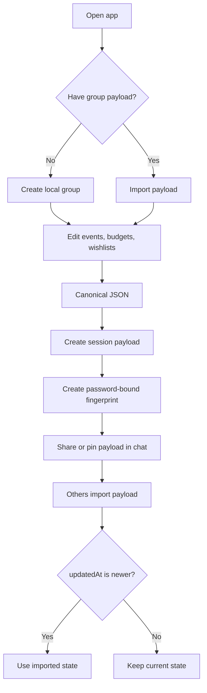
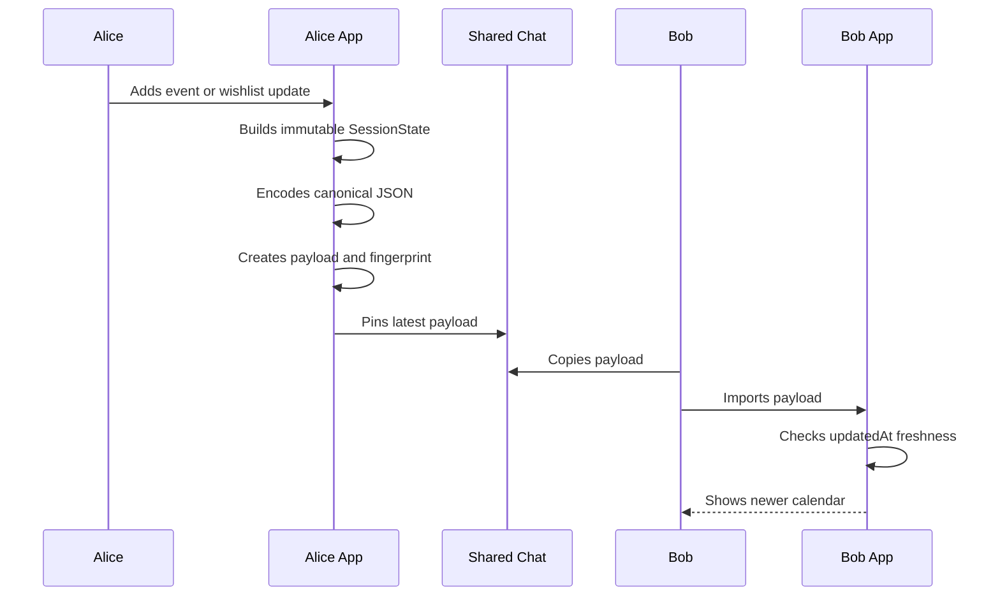
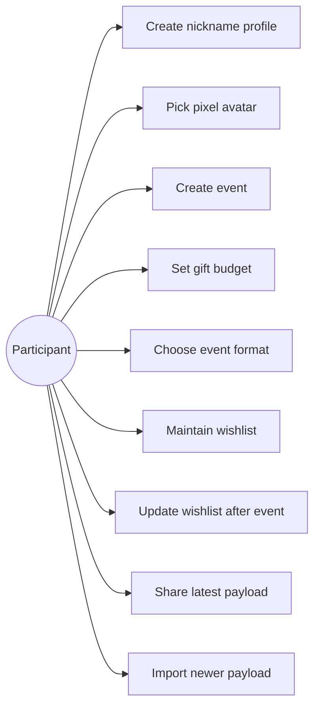

# Architecture

## Flow

```mermaid
flowchart TD
  A[Open app] --> B{Have group payload?}
  B -- No --> C[Create local group]
  B -- Yes --> D[Import payload]
  C --> E[Edit events, budgets, wishlists]
  D --> E
  E --> F[Canonical JSON]
  F --> G[Create session payload]
  G --> H[Create password-bound fingerprint]
  H --> I[Share or pin payload in chat]
  I --> J[Others import payload]
  J --> K{updatedAt is newer?}
  K -- Yes --> L[Use imported state]
  K -- No --> M[Keep current state]
```

## Sequence

```mermaid
sequenceDiagram
  participant A as Alice
  participant AppA as Alice App
  participant Chat as Shared Chat
  participant B as Bob
  participant AppB as Bob App

  A->>AppA: Adds event or wishlist update
  AppA->>AppA: Builds immutable SessionState
  AppA->>AppA: Encodes canonical JSON
  AppA->>AppA: Creates payload and fingerprint
  AppA->>Chat: Pins latest payload
  B->>Chat: Copies payload
  B->>AppB: Imports payload
  AppB->>AppB: Checks updatedAt freshness
  AppB-->>B: Shows newer calendar
```

## Use cases

```mermaid
flowchart LR
  U((Participant)) --> U1[Create nickname profile]
  U --> U2[Pick pixel avatar]
  U --> U3[Create event]
  U --> U4[Set gift budget]
  U --> U5[Choose event format]
  U --> U6[Maintain wishlist]
  U --> U7[Update wishlist after event]
  U --> U8[Share latest payload]
  U --> U9[Import newer payload]
```
